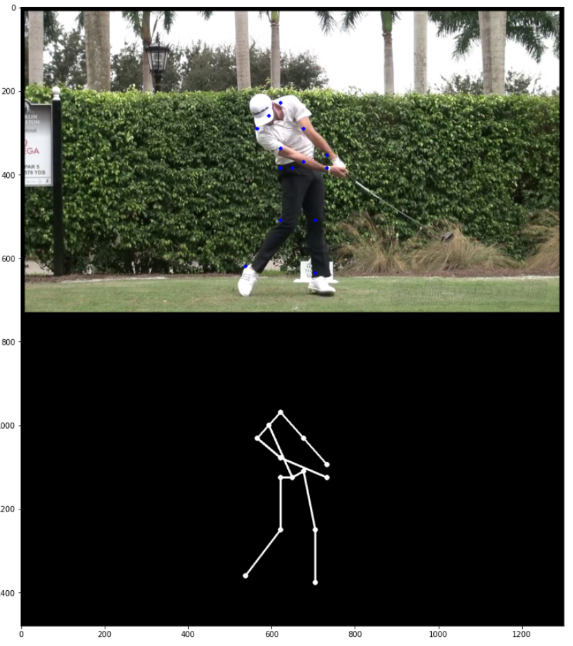

# POSE DETECTION - GOLF SWING

## Introduction
This use case focus on pose detection task by using [OPEN POSE](https://cmu-perceptual-computing-lab.github.io/openpose/web/html/doc/) project.

* Introduction
* Import libraries
* Download the video and capture the images for the pose detection
* Download video
* Setup model
* Detect key points and draw the skeleton

